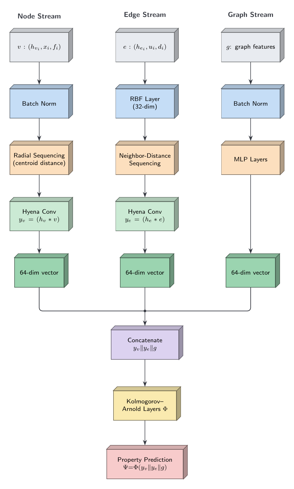
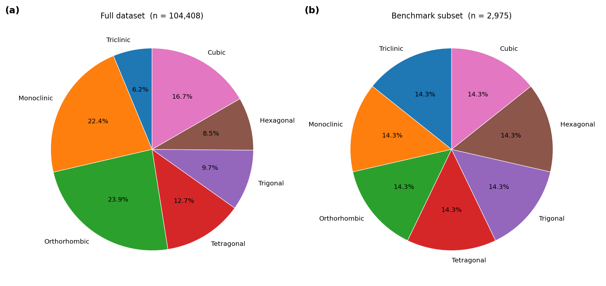
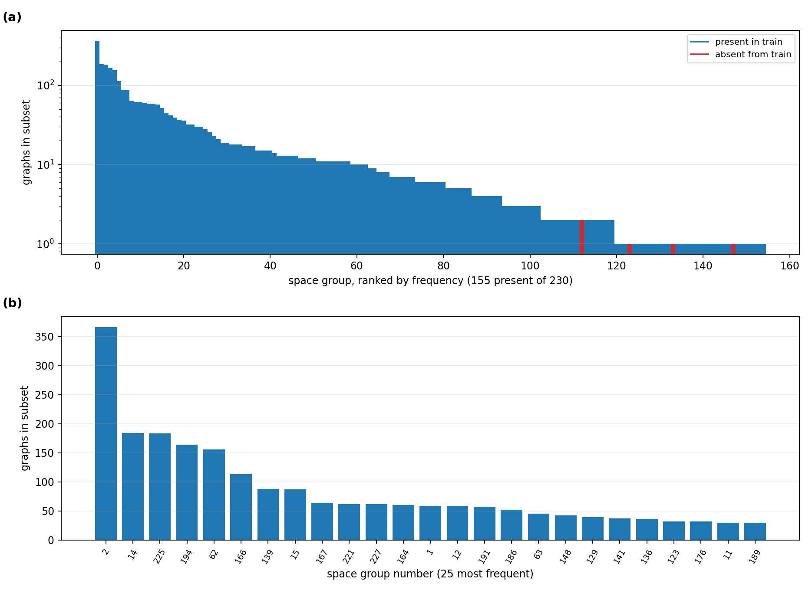
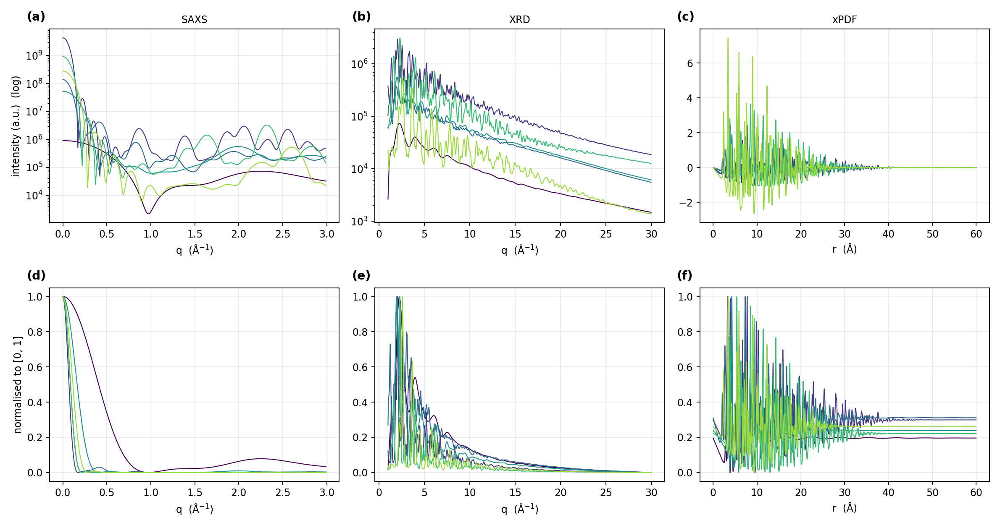
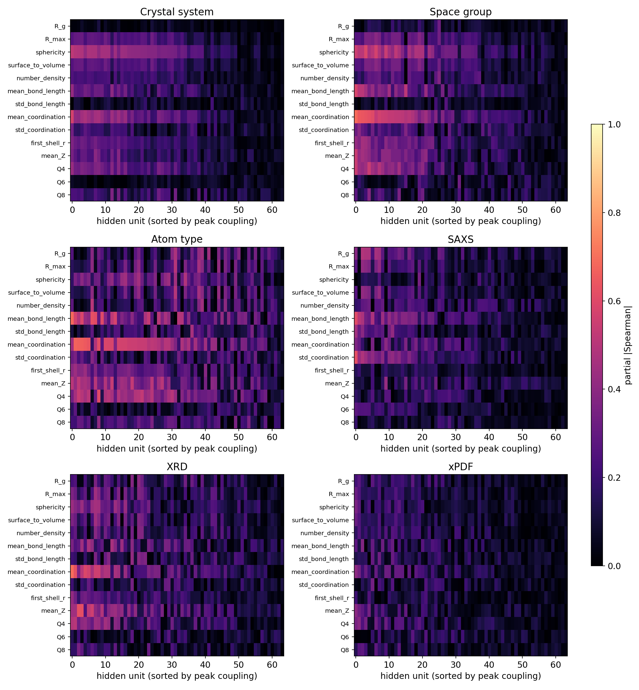
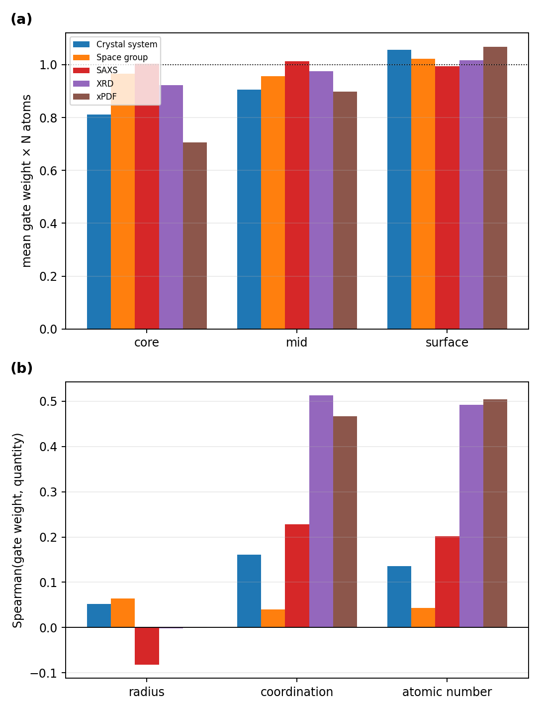
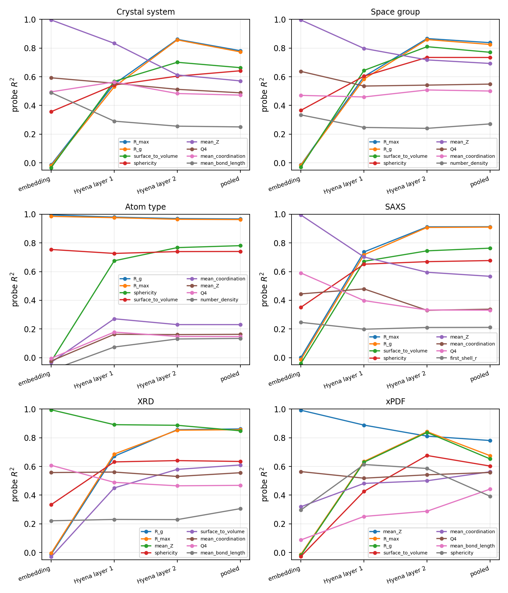
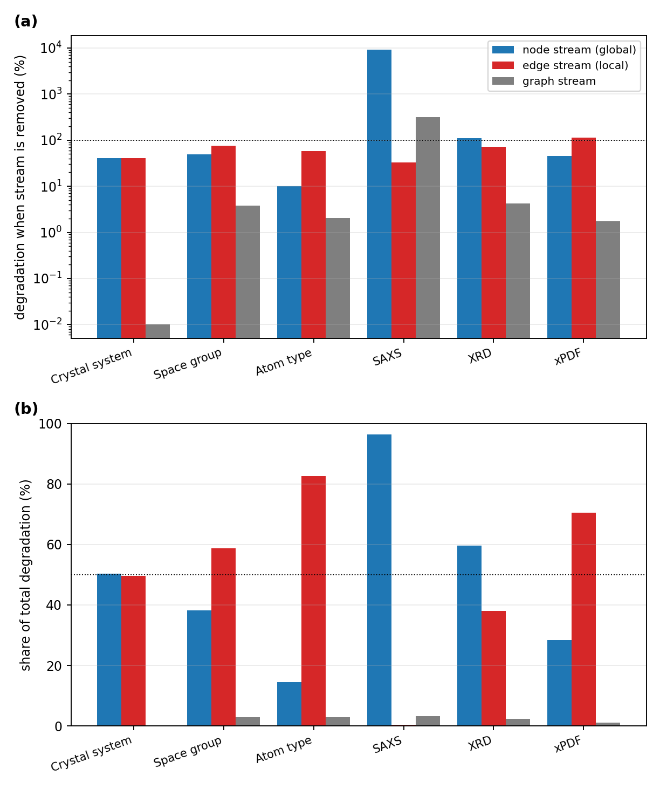

# Radial Hyena Networks for Property Prediction of Nanomaterials

Code, benchmark data and trained weights for **Radial Hyena**, a long-convolutional graph
network for property prediction on inorganic nanoparticles, evaluated on the six
CHILI-100K benchmark tasks: crystal-system, space-group and atom-type classification, and
SAXS, XRD and xPDF scattering-pattern regression.

Benchmark data, trained weights and training records are hosted on Hugging Face:
**https://anonymous-hf.com/a/jp5aih03acut/**

| | |
|---|---|
| Paper | *Radial Hyena Networks for Property Prediction of Nanomaterials* |
| Data, weights, training records | Hugging Face: [anonymous-hf.com/a/jp5aih03acut](https://anonymous-hf.com/a/jp5aih03acut/) |
| Dataset | CHILI-100K (Friis-Jensen et al., 2024), official 2,975-graph benchmark subset |
| Licence | MIT (code) |

**Contents:** [Model](#model) · [Data and preprocessing](#data-and-preprocessing) ·
[Training](#training) · [Results](#results) · [Mechanistic analysis](#mechanistic-analysis) ·
[Reproducing the results](#reproducing-the-results) · [Repository layout](#repository-layout)

---

## Model

<p align="center"></p>

A nanoparticle is a graph $G = (V, E, \mathbf{g})$ of atoms, bonds and graph-level
attributes. Radial Hyena processes it in three streams whose outputs are concatenated and
read out by a Kolmogorov-Arnold network (KAN).

**Inputs and embeddings.** Each atom carries its atomic number (32-d embedding) and three
scalar features (atomic radius, atomic weight, electron affinity), scaled by a `BatchNorm1d`
layer inside the model and embedded by a two-layer MLP into 64 dimensions. Each bond carries
its length $d$, expanded in 32 Gaussian radial basis functions over 0–6 Å, and embedded into
64 dimensions. The graph stream receives $[\log(1+N_{\text{atoms}}),\ N_{\text{species}},\ \text{size rank}]$
after a `BatchNorm1d` layer.

**Hyena long convolution.** Both sequence streams use a Hyena operator: a causal long
convolution evaluated with the FFT, whose filter is not a free parameter but is generated
*implicitly* by a small MLP with sine activations from a conditioning signal at every
sequence position, plus a learned per-channel skip term.

**Node stream (radial).** All atoms of a particle form one sequence. At every position the
implicit filter is generated from a 32-function RBF expansion of the atom's normalised
distance to the particle centroid, $r/r_{\max}$ (0 = centre, 1 = outermost atom), so the
operator is conditioned on a physical field rather than on sequence position. Sequence
positions are assigned by a stable sort on the float32 key $b \cdot 10^{9} + r$ ($b$ = index
of the particle in the batch). Each layer adds a linear embedding of the centred atomic
coordinates $x$ to its input — the one component of the model that depends on particle
orientation; all other inputs are distances, angles and scalar chemistry. Layers are
residual: $h_v \leftarrow h_v + \mathrm{LN}(\mathrm{Hyena}(\mathrm{LN}(h_v) + W x))$.

**Edge stream (local).** Every atom contributes a sequence of up to 12 of its bonds
(stable sort on the float32 key $i \cdot 10^{7} + d$ for source atom $i$). Each element is
$[\,h_e \,\|\, \mathrm{RBF}_{32}(d) \,\|\, \cos(n\theta)_{n=0..15}\,]$, with $\theta$ the
angle between the bond and the first bond of that atom's sequence; the filter is generated
from $\mathrm{RBF}_{32}(d)$. The convolved sequence is projected back to 64 dimensions and
added to the bond features, followed by LayerNorm.

**Graph stream.** A two-layer MLP (SiLU) producing a 64-d graph vector.

**Read-out.** Node and bond features are pooled per particle with learned softmax gates,
concatenated with the graph vector, $[\,y_v \,\|\, y_e \,\|\, g\,] \in \mathbb{R}^{192}$, and
mapped to the output by a KAN with one hidden layer ($192 \to 64 \to$ output). Every KAN edge
combines a SiLU base branch with a cubic B-spline on a 5-interval grid over $[-1, 1]$
(8 coefficients per edge); dropout 0.1 is applied between the two KAN layers. For
atom-type classification (a node-level task) the KAN reads, per atom,
$[\,h_v \,\|\, \text{mean of incident bond features} \,\|\, g\,]$.

Two Hyena layers are used in both streams. One model is trained per task; the architecture
is identical across tasks apart from the width of the last KAN layer:

| Task | Output | Parameters |
|---|---|---|
| Crystal system | 7 classes | 220,878 |
| Space group | 230 classes | 349,326 |
| Space group, train-split vocabulary¹ | 151 classes | 303,822 |
| Atom type | 118 classes | 284,808 |
| SAXS | 300 points | 389,646 |
| XRD | 580 points | 550,926 |
| xPDF | 6,000 points | 3,672,846 |

¹ One class per space group present in the training split; used for the mechanistic analyses of the space-group head.

Implementation: [`radial_hyena/model.py`](radial_hyena/model.py) (network),
[`radial_hyena/kan.py`](radial_hyena/kan.py) (KAN layers),
[`radial_hyena/config.py`](radial_hyena/config.py) (hyper-parameters).

---

## Data and preprocessing

**Source.** CHILI-100K contains 104,408 nanoparticle graphs cut from 20,882 experimentally
determined crystal structures (Crystallography Open Database), each material at up to five
particle sizes, with simulated SAXS, XRD and xPDF patterns for every particle.

**Benchmark subset.** Following the protocol of the published CHILI and KAGNN baselines,
425 graphs are drawn per crystal system (`numpy.random.default_rng(42)` over the metadata
index of the release, files in sorted order), giving 2,975 graphs. They are split 80/10/10
over individual graphs with `sklearn.model_selection.train_test_split`, stratified by
space-group number, `random_state=42`: **2,379 train / 298 validation / 298 test**. The
exact subset and split are tracked in
[`splits/chili100k_benchmark_split.json`](splits/chili100k_benchmark_split.json) (source file,
particle size, labels and split membership of every graph).

| | |
|---|---|
| Atoms per graph | 4 – 10,345 (median 1,037) |
| Edges per graph | 4 – 94,092 (median 5,386) |
| Space groups | 155 in the subset, 151 in the training split; 3 test graphs belong to groups absent from training |

<p align="center">
<br>
<em>Crystal-system shares in the full dataset and in the stratified benchmark subset.</em>
</p>
<p align="center">
<br>
<em>Space-group frequencies in the subset (red: groups absent from the training split).</em>
</p>

**Inputs.** Coordinates are centred on the particle centroid. Bond lengths and unit vectors
are computed from the centred coordinates over the bonds provided by CHILI. Node scalars and
graph attributes enter the model raw and are scaled by the in-model `BatchNorm1d` layers,
whose running statistics accumulate on training batches only. For atom-type classification
the chemistry is the label, so atomic number and scalar features are removed: every atom
receives the same token and its centred coordinates divided by 10.

**Targets.**

| Task | Target | Loss | Metric |
|---|---|---|---|
| Crystal system | 7 classes | cross-entropy | weighted F1 |
| Space group | 230 classes (space-group number − 1) | cross-entropy | weighted F1 |
| Atom type | element of every atom, 118 classes | cross-entropy | weighted F1 |
| SAXS | $I(q)$, 300 points, $q$ = 0–2.99 Å⁻¹ | MSE | MSE |
| XRD | $I(q)$, 580 points, $q$ = 1–29.95 Å⁻¹ | MSE | MSE |
| xPDF | $G(r)$, 6,000 points, $r$ = 0–59.99 Å | MSE | MSE |

Scattering curves are min–max normalised per sample to [0, 1], as in the baseline
protocol, so the reported MSE is dimensionless.

<p align="center">
<br>
<em>SAXS, XRD and xPDF curves of six particles before (top) and after (bottom) per-sample min–max normalisation.</em>
</p>

The benchmark subset is distributed as a single HDF5 file (`chili100k_benchmark.h5`,
123 MB) on [Hugging Face](https://anonymous-hf.com/a/jp5aih03acut/), redistributed under the
CC-BY-4.0 licence of CHILI-100K. It can be rebuilt from, and verified against, the original
CHILI-100K release with [`scripts/build_benchmark.py`](scripts/build_benchmark.py).

---

## Training

| | |
|---|---|
| Optimiser | AdamW, learning rate 3×10⁻⁴, weight decay 1×10⁻⁴ |
| Schedule | ReduceLROnPlateau on the validation metric: factor 0.5, patience 8, minimum 10⁻⁶ |
| Stopping | at most 150 epochs; early stopping after 25 epochs without validation improvement |
| Batch size | 16 graphs |
| Gradient clipping | global norm 1.0 |
| Regularisation | dropout 0.1 in the KAN; node dropping during training (each atom of a graph with more than 24 atoms is removed with probability 0.2, with its bonds, provided at least 12 atoms remain) |
| Model selection | best validation metric; the best checkpoint is reloaded and evaluated once on the test split |
| Seeds | 0, 1, 2 |
| Hardware | one 24–48 GB GPU per run (recorded: NVIDIA RTX 4090, L40S, RTX 6000 Ada), PyTorch 2.5.1 with CUDA 12.1 |

Validation and test metrics are logged every epoch; model selection, early stopping and the
learning-rate schedule use the validation metric only. Implementation:
[`scripts/train.py`](scripts/train.py).

---

## Results

CHILI-100K benchmark, test split, mean ± standard deviation over three seeds (weighted F1
for classification, MSE for regression). Baseline values are those published by
Friis-Jensen et al. (CHILI, 2024) and Volzhin & Yoon (KAGNN, 2026). **Bold**: best,
<ins>underlined</ins>: second best.

| Model | Crystal system ↑ | Space group ↑ | Atom type ↑ | SAXS ↓ | XRD ↓ | xPDF ↓ |
|---|---|---|---|---|---|---|
| GCN | 0.069 ± 0.023 | 0.043 ± 0.001 | 0.275 ± 0.002 | 0.010 ± 0.000 | 0.009 ± 0.000 | 0.014 ± 0.000 |
| PMLP | 0.124 ± 0.036 | 0.047 ± 0.012 | 0.191 ± 0.000 | <ins>0.003 ± 0.000</ins> | 0.008 ± 0.001 | 0.013 ± 0.000 |
| GraphSAGE | 0.061 ± 0.019 | 0.044 ± 0.002 | 0.195 ± 0.007 | 0.011 ± 0.002 | 0.018 ± 0.014 | 0.037 ± 0.026 |
| GAT | 0.110 ± 0.029 | 0.044 ± 0.001 | 0.192 ± 0.000 | 0.009 ± 0.000 | 0.009 ± 0.000 | 0.013 ± 0.000 |
| GraphUNet | 0.068 ± 0.006 | 0.043 ± 0.000 | 0.287 ± 0.004 | 0.009 ± 0.000 | 0.009 ± 0.000 | 0.013 ± 0.000 |
| GIN | 0.069 ± 0.040 | 0.043 ± 0.000 | 0.336 ± 0.005 | 0.009 ± 0.000 | 0.009 ± 0.000 | 0.013 ± 0.000 |
| EdgeCNN | 0.072 ± 0.047 | 0.158 ± 0.035 | **0.572 ± 0.017** | 0.007 ± 0.009 | <ins>0.006 ± 0.000</ins> | 0.012 ± 0.000 |
| KAGCN | <ins>0.477 ± 0.008</ins> | <ins>0.216 ± 0.009</ins> | 0.317 ± 0.002 | 0.038 ± 0.000 | 0.007 ± 0.000 | <ins>0.011 ± 0.000</ins> |
| KAGIN | 0.190 ± 0.034 | 0.052 ± 0.009 | 0.374 ± 0.002 | unstable | unstable | 0.089 ± 0.006 |
| KAEdgeCNN | 0.295 ± 0.024 | 0.118 ± 0.012 | 0.449 ± 0.002 | 0.089 ± 0.070 | 0.084 ± 0.105 | 0.452 ± 0.613 |
| **Radial Hyena** | **0.665 ± 0.014** | **0.451 ± 0.005** | <ins>0.547 ± 0.005</ins> | **0.00021 ± 0.00005** | **0.00363 ± 0.00004** | **0.00823 ± 0.00017** |

Per-seed test results of the released checkpoints:

| Task | Seed 0 | Seed 1 | Seed 2 | Mean ± std |
|---|---|---|---|---|
| Crystal system (weighted F1) | 0.6771 | 0.6710 | 0.6457 | 0.6646 ± 0.0136 |
| Space group (weighted F1) | 0.4580 | 0.4499 | 0.4456 | 0.4511 ± 0.0051 |
| Atom type (weighted F1) | 0.5507 | 0.5513 | 0.5396 | 0.5472 ± 0.0053 |
| SAXS (MSE) | 2.148×10⁻⁴ | 1.556×10⁻⁴ | 2.710×10⁻⁴ | (2.14 ± 0.47)×10⁻⁴ |
| XRD (MSE) | 3.586×10⁻³ | 3.682×10⁻³ | 3.617×10⁻³ | (3.63 ± 0.04)×10⁻³ |
| xPDF (MSE) | 8.454×10⁻³ | 8.059×10⁻³ | 8.174×10⁻³ | (8.23 ± 0.17)×10⁻³ |
| Space group, train-split vocabulary (weighted F1) | 0.4402 | 0.4590 | 0.4490 | 0.4494 ± 0.0077 |

Standard deviations are population standard deviations over the three seeds.

---

## Mechanistic analysis

All analyses are evaluation-only, on the seed-0 checkpoints and the 298 test particles
(for space group, the train-split-vocabulary model). Scripts are in [`experiments/`](experiments).

### Physical descriptors

[`experiments/descriptors.py`](experiments/descriptors.py) computes, from the 3-D coordinates
of every test particle, the radius of gyration $R_g$, the distance to the outermost atom
$R_{\max}$, sphericity $R_g/R_{\max}$, the surface-to-volume ratio $3/R_{\max}$, the number
density, the mean and standard deviation of bond length and of coordination number, the
position of the first peak of $g(r)$, the mean atomic number, and the Steinhardt
bond-orientational order parameters $Q_4$, $Q_6$, $Q_8$.

### Hidden units of the KAN read-out vs physical descriptors

[`experiments/couplings.py`](experiments/couplings.py) correlates each of the 64 hidden units
of the KAN (input of its second layer; atom type: averaged over the atoms of each particle)
with each descriptor by partial Spearman correlation: all variables are rank-transformed
and the model's own graph inputs ($\log(1+N)$, number of species, size rank) are regressed
out of both sides.

<p align="center"></p>

| Task | Strongest descriptor (peak partial \|ρ\|) | Units with peak \|ρ\| > 0.4 |
|---|---|---|
| Crystal system | mean coordination (0.57) | 20 / 64 |
| Space group | mean coordination (0.69) | 24 / 64 |
| Atom type | mean bond length (0.69) | 48 / 64 |
| SAXS | std. of coordination (0.62) | 13 / 64 |
| XRD | mean coordination (0.70) | 20 / 64 |
| xPDF | mean coordination (0.40) | 0 / 64 |

The symmetry-related heads (crystal system, space group) and XRD couple most strongly to the
mean coordination number; the atom-type head couples most strongly to the mean bond length.

### Pooling gates

[`experiments/internals.py`](experiments/internals.py) extracts the node-pooling softmax
weight of every atom (scaled by the atom count, so 1.0 is uniform attention), bins atoms
into core / mid / surface thirds of $r/r_{\max}$, and correlates the weight with each atom's
normalised radius, coordination number and atomic number (Spearman). Atom type has no
pooling gate.

<p align="center"></p>

| Task | Core | Mid | Surface | ρ(gate, radius) | ρ(gate, coordination) | ρ(gate, Z) |
|---|---|---|---|---|---|---|
| Crystal system | 0.81 | 0.91 | 1.06 | +0.05 | +0.16 | +0.14 |
| Space group | 0.97 | 0.96 | 1.02 | +0.06 | +0.04 | +0.04 |
| SAXS | 1.00 | 1.01 | 0.99 | −0.08 | +0.23 | +0.20 |
| XRD | 0.92 | 0.97 | 1.02 | −0.00 | +0.51 | +0.49 |
| xPDF | 0.71 | 0.90 | 1.07 | −0.00 | +0.47 | +0.50 |

### Layer probes

The same script fits cross-validated ridge probes (5-fold, $R^2$) for every descriptor from
the particle-mean node representation after the embedding and after each Hyena layer, and
from the pooled representation.

<p align="center"></p>

Probe $R^2$ for $R_{\max}$:

| Task | Embedding | Hyena layer 1 | Hyena layer 2 | Pooled |
|---|---|---|---|---|
| Crystal system | −0.01 | 0.55 | 0.86 | 0.78 |
| Space group | −0.01 | 0.60 | 0.87 | 0.84 |
| Atom type | 0.99 | 0.98 | 0.97 | 0.96 |
| SAXS | 0.00 | 0.74 | 0.91 | 0.91 |
| XRD | −0.01 | 0.69 | 0.85 | 0.86 |
| xPDF | −0.01 | 0.64 | 0.84 | 0.68 |

Except for atom type, whose input is the coordinates themselves, particle-size information
is absent from the embeddings and becomes linearly decodable through the Hyena layers.

### Stream ablation

[`experiments/stream_ablation.py`](experiments/stream_ablation.py) removes one stream at a time
by zeroing its 64-d slice of the KAN input (no weight changes) and measures the degradation
of the test metric.

<p align="center"></p>

| Task | Node stream removed | Edge stream removed | Graph stream removed | Node / edge share |
|---|---|---|---|---|
| Crystal system | +40.9 % | +40.3 % | −2.1 % | 50 % / 50 % |
| Space group | +49.7 % | +75.9 % | +3.8 % | 38 % / 59 % |
| Atom type | +10.2 % | +58.3 % | +2.1 % | 14 % / 83 % |
| SAXS | +9273 % | +33.2 % | +318 % | 96 % / 0.3 % |
| XRD | +112.1 % | +71.6 % | +4.3 % | 60 % / 38 % |
| xPDF | +45.5 % | +112.7 % | +1.7 % | 28 % / 71 % |

Degradation is the relative drop in weighted F1 (classification) or the relative increase in
MSE (regression); the share is each stream's fraction of the summed degradation.

---

## Reproducing the results

### 1. Install

```bash
git clone <this repository> && cd radial-hyena
python -m venv .venv && source .venv/bin/activate
pip install -r requirements.txt          # PyTorch with CUDA: see pytorch.org for the matching wheel
python -m pytest -q                      # unit tests (the data test runs once data/ is downloaded)
```

### 2. Download data, weights and training records

The [Hugging Face repository](https://anonymous-hf.com/a/jp5aih03acut/) holds the benchmark
file, the 21 released checkpoints and the training records (per-epoch histories, split
indices, software versions):

| File | Contents |
|---|---|
| `data/chili100k_benchmark.h5` | the 2,975 benchmark graphs, labels, scattering curves and split |
| `checkpoints/<task>_seed<k>.pt` | weights of the 18 reported models (`task` ∈ crystal_system, space_group, atom, saxs, xrd, xpdf) |
| `checkpoints/space_group_trainvocab_seed<k>.pt` | space-group models with the train-split vocabulary (used in the analyses) |
| `records/` | training records: `<task>_seed<k>_results.json`, `space_group_seed<k>_history.json`, `*.log` |
| `MANIFEST.md5` | MD5 checksums of every file |

**During review**, download the repository through the link above and install it with

```bash
python scripts/download.py --from-dir /path/to/downloaded/repository
```

which checks every file against `MANIFEST.md5` and copies it to `data/`, `checkpoints/` and
`results/training/`; nothing is installed if any file is missing or fails its checksum.

**Direct download** from the Hugging Face repository:

```bash
python scripts/download.py --all      # -> data/, checkpoints/, results/training/
```

The repository id is set in [`radial_hyena/hub.py`](radial_hyena/hub.py); override it with
`--repo` or the `RADIAL_HYENA_HF_REPO` environment variable, and pin a version with
`--revision`. Every download is checked against `MANIFEST.md5`.

### 3. Benchmark table

```bash
python scripts/evaluate.py                          # all tasks, seeds 0-2
python scripts/evaluate.py --tasks space_group --sg-vocab train --out-dir results/evaluation_sg_trainvocab
```

This writes `results/evaluation/benchmark_table.md` and, for every checkpoint, compares the
recomputed test metric with the value recorded at training time.

### 4. Mechanistic analyses and figures

```bash
python experiments/descriptors.py       # physical descriptors of the test particles (CPU, ~2 min)
python experiments/couplings.py         # figures/descriptor_couplings.png
python experiments/internals.py         # figures/pooling_gates.png, figures/layer_probes.png
python experiments/stream_ablation.py   # figures/stream_ablation.png
python experiments/data_card.py         # figures/data_*.png
```

`make all` runs download, tests, evaluation and every analysis in order.

### 5. Training from scratch

```bash
python scripts/train.py --task crystal_system --seed 0
python scripts/train.py --task space_group --seed 0                   # 230-class head
python scripts/train.py --task space_group --seed 0 --sg-vocab train  # train-split vocabulary
```

Each run writes its best checkpoint and a results JSON with the full per-epoch history to
`runs/`. The released models were trained on single 24–48 GB GPUs.

### 6. Rebuilding the benchmark from CHILI-100K

```bash
python scripts/build_benchmark.py --source /path/to/CHILI-100K.zip                  # build
python scripts/build_benchmark.py --source /path/to/CHILI-100K.zip --verify data/chili100k_benchmark.h5
```

The build scans the release, draws the subset, applies the split, asserts that both match
[`splits/chili100k_benchmark_split.json`](splits/chili100k_benchmark_split.json) and writes the
HDF5 file; `--verify` compares every graph of an existing file with the release.

### Reproducibility protocol

* **Fixed data.** The subset and split are fixed by seeds (42) and tracked in
  `splits/chili100k_benchmark_split.json`; `Benchmark.check_split()` re-derives the split from
  the space-group labels on every load.
* **Deterministic evaluation.** Test graphs are evaluated in their stored order with batch
  size 16, the configuration used when the checkpoints were trained and tested. Sequence
  orders use stable sorts, so a batch gives the same result on GPU and CPU; when a batch
  does not fit in GPU memory, evaluation falls back to a CPU copy of the model for that batch.
* **Seeded training.** Python, NumPy and PyTorch seeds, deterministic cuDNN, and one seeded
  generator shared by all data loaders (shuffling and node dropping). CUDA scatter-add has no
  deterministic kernel, so retrained weights agree with the released ones statistically
  rather than bit for bit; the released checkpoints reproduce the reported numbers exactly.
* **Recorded provenance.** Every training record stores the split indices, the full
  configuration, per-epoch metrics and software/hardware versions.

**Verification of this release** (NVIDIA T500 4 GB, PyTorch 2.9.1, PyG 2.7.0):

| Check | Result |
|---|---|
| Benchmark file vs the original CHILI-100K release, all 2,975 graphs (coordinates, bonds, node features, labels, scattering curves and axes) | identical |
| Subset and split re-derived from the release index vs the split recorded in every training run | identical |
| 21 checkpoints load into `RadialHyena` with `strict=True`; parameter counts as in the table above | yes |
| Test metrics recomputed with `scripts/evaluate.py` vs the values recorded at training time | crystal system and both space-group heads (9 checkpoints): identical; SAXS, XRD, xPDF (9 checkpoints): within 0.1 % relative; atom type (seeds 0 and 1): within 3×10⁻⁵ weighted F1. The results table is reproduced for all six tasks |
| Physical descriptors of the 298 test particles | identical |
| Descriptor couplings (graph-level tasks) | every value of the 64 × 14 matrices within 0.004; peak couplings within 0.001 |
| Pooling gates and layer probes (graph-level tasks) | gate statistics within 0.001; probe $R^2$ within 0.03 |
| Stream ablation (graph-level tasks) | crystal system identical; regression metrics within 0.3 %; space group with the edge stream removed 0.1046 vs 0.1062 weighted F1, all other entries identical |
| Dataset figures | identical |

Remaining differences come from floating-point arithmetic on different GPUs and software
versions, and from the batches that the 4 GB test GPU evaluated on the CPU.

---

## Repository layout

```
radial_hyena/          model, KAN layers, data pipeline, metrics, checkpoint and Hugging Face download helpers
scripts/               train.py, evaluate.py, download.py, build_benchmark.py
experiments/           descriptors, couplings, internals (gates + probes), stream ablation, data card
splits/                benchmark subset and official split (tracked)
tests/                 unit tests
docs/images/           figures shown in this README
```

Generated files go to `data/`, `checkpoints/`, `results/`, `figures/` and `runs/` (not tracked).

## Citation

```bibtex
@article{patel2026radialhyena,
  title  = {Radial Hyena Networks for Property Prediction of Nanomaterials},
  author = {Patel, Shrey},
  year   = {2026}
}
```

Please also cite the CHILI dataset:

```bibtex
@article{friisjensen2024chili,
  title   = {{CHILI}: Chemically-Informed Large-scale Inorganic Nanomaterials Dataset for Advancing Graph Machine Learning},
  author  = {Friis-Jensen, Ulrik and Johansen, Frederik L. and Anker, Andy S. and Dam, Erik B. and Jensen, Kirsten M. {\O}. and Selvan, Raghavendra},
  journal = {arXiv preprint arXiv:2402.13221},
  year    = {2024}
}
```

## Acknowledgements

The KAN layers follow the efficient-KAN formulation (Blealtan, 2024); the long-convolution
operator follows Hyena (Poli et al., 2023). Baseline numbers are taken from the CHILI
(Friis-Jensen et al., 2024) and KAGNN (Volzhin & Yoon, 2026) papers.

## Licence

MIT — see [LICENSE](LICENSE).
